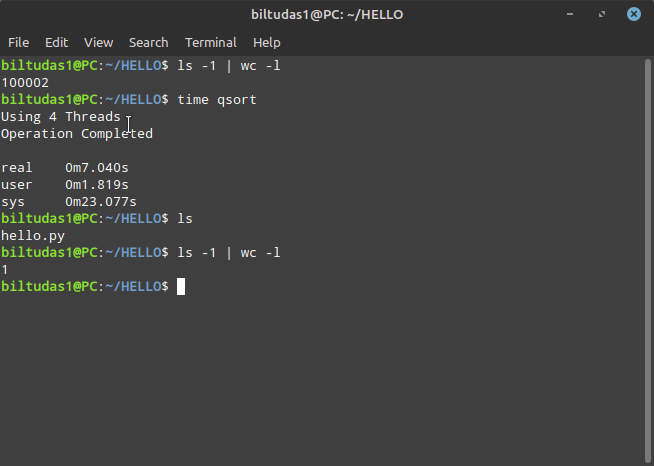

# Quick File Sorter
Quick File Sorter is a command-line tool for automatically sorting files based on their file extension. It can sort various types of files, such as documents, images, music, and videos, into their respective folders. This tool can save you a lot of time and effort in manually sorting your files.

## Features
* This tool automatically sorts files based on their file extensions and mime types, although it currently does not support document type files.
* It supports various types of files including images, music, and videos, as well as documents.
* Configuration is easy through the use of the qsort.conf file.
* This tool is available as a command-line tool.

## How it works
Quick File Sorter reads all extension data from extensions.json and loads them into different groups using C++ strings. It then reads the qsort.conf file and moves files to a specific path based on the matched extensions using the C++ std::filesystem::rename function.

## Requirements

* CMake 3.22 or higher
* libmagic-dev

## Building & Installing
You can build the source code yourself by cloning the repository and running the following commands:

```
git clone https://github.com/BiltuDas1/qsort.git
cd qsort/
cmake -B build .
cd build/
sudo make install
```
Alternatively, you can download pre-built binaries from the releases page.

### Source Code Building
|Task Name|`main`|`pre/beta`|
|---------|------|----------|
|AutoCheck|||
|Release|| Not Applicable :x: |

## Usage
Once installed, simply navigate to the directory containing the files you want to sort and enter the `qsort` command. Quick File Sorter will automatically sort files to their respective type of documents (i.e doc, ppt, pdf all those file will be moved into Document Folder).


### Parameters
|Parameter|Description|  
|---------|-----------|
|--version|Prints the version information of the qsort program.|
|--help|Shows the help window, which lists all the available parameters and their descriptions.|
|--edit-conf [cli]|Opens the qsort configuration file. If the optional cli parameter is specified, then it will force the program to open the configuration file in command-line interface mode. This parameter requires sudo privileges.|
|--thread [count]|Specifies the number of threads that the qsort program will use for sorting. The value of count can be any positive integer between 1 and the max core your pc have. If this parameter is not specified, then the program will use a single thread for sorting.|
|--custom-conf [filename] or -cc|Allows the user to choose a custom configuration file for the qsort program. The filename parameter specifies the name of the custom configuration file that the user wants to use. The -cc option is a shorthand for this parameter.|
|--mime|(Beta) This parameter forces the qsort program to sort files according to their MIME type. By default, the program sorts files based on their file extensions. This parameter is still in beta, and its functionality may be limited or unstable.|

# Configuration
Quick File Sorter uses a configuration file to determine where to move the files. The default configuration file is located at /etc/qsort/qsort.conf. To modify the configuration, you can edit this file using your favorite text editor.

The qsort.conf file allows you to specify the paths where files should be moved to, and to exclude certain files or file extensions from being moved.


## Path Configuration
The Path section specifies the destination path for each file type. You can use predefined variables or provide custom paths.

To specify the path where a particular file type should be moved to, use the following format in the `[Path]` section of the qsort.conf file:

```
[type]=$PATH
```
For example, to specify that all image files should be moved to the Pictures directory, use:
```
Pictures=$PICTURES
```
Note that the `$PICTURES` variable is obtained from the xdg-user-dirs system, which is set to `/home/user/Pictures`. While you can use the direct path `/home/user/Pictures` in your configuration file.

You can also refer to the [xdg-user-dirs](https://wiki.archlinux.org/title/XDG_user_directories) documentation to learn more about using predefined variables for directory paths.

Currently The following types are supported:

* General
* Videos
* Pictures
* Documents
* Music


## Exclusion Configuration
The Exclude section allows you to exclude certain files or file types from being moved. You can exclude files by their extensions or specific filenames.

To exclude certain files or file extensions from being moved, use the following format in the [Exclude] section of the qsort.conf file:

```
[Exclude]
Extensions=ext1,ext2
Filenames=file1,file2
```

For example, to exclude all files with the .txt and .py extensions, as well as a file named requirements.txt, use:

```
[Exclude]
Extensions=py,txt
Filenames=requirements.txt
```
In the example above, the extensions py and txt are excluded, meaning files with these extensions will not be moved. Additionally, the file named requirements.txt will be excluded.

Please note that the configuration file can be customized to suit your specific needs. Make sure to follow the format specified in the examples above and adjust the paths and exclusions accordingly.


Here is a Final Example of qsort.conf file:

```
[Path]
General=$HOME
Videos=$VIDEOS
Pictures=$PICTURES
Documents=$DOCUMENTS
Music=$MUSIC

[Exclude]
Extensions=py,txt
Filenames=requirements.txt
```

Note: Incorrect Configuration might crash the program without any warning.

### Speed
I can't gurentee that the speed will be same into your own Condition, but here is the speed for my personal laptop



It took about 7 second to sort 100k + 2 files

Processor: Intel Core i5 M460 @ 2.53GHz  
RAM: 6GiB  
Hard Disk: HS-SSD-E100 256G

## License
This project is licensed under [MIT License](/LICENSE)

## Contributing
If you would like to add a new feature to Quick File Sorter, please create an issue first to discuss the feature with the project owner and gain approval before proceeding with any changes. If you encounter an issue or bug that you would like to fix, you are welcome to create a pull request with your proposed changes directly. Contributions of any kind are greatly appreciated!